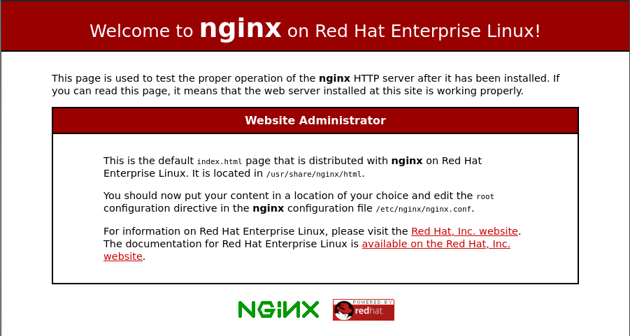

The tools used to design this website are Hugo and Nginx. I want a static site so Hugo is perfect for that. I chose Nginx because I want to lean more about it. I'm hosting this website on a VPS using Centos8. I'm designing the website using vscode on Arch Linux.

There's a few things I want to do here:

1. Set up the website so it can be accessed from the web
2. Add SSL certificate
3. Harden Nginx settings

### Setting up the website

The first thing is to create a new website with Hugo in the current directory on my own machine.

```
hugo new website tylerengle_blog
```

This creates the necessary files and folder structure for Hugo in the folder tylerengle_blog. 


Then a theme needs to be selected. This site uses beautifulhugo:

```
cd themes
git submodule add https://github.com/halogenica/beautifulhugo.git beautifulhugo
```

The theme is set in the config.toml file:
```
theme = "beautifulhugo"
```

Now the site should be set to start adding pages.

### Adding Pages
Pages are stored in the content folder. I use have page and Posts subdirectories. I also use a leaf structure to hold my pages, which means each page has its own directory to store its content. The 'page' directory contains non-post pages like the about page. Posts contains all the blog posts like this one.

To add a post using this scheme, create a directory for the page, then an 'index.md' file within that folder:
```
mkdir content/Posts/<name of page>
hugo new Posts/<name of page>/index.md
```

Hugo adds a title, creation date, and sets this page as a draft.

To add a non-post page:

```
hugo new page/<name of page>
```
From here I've created a few pages and posts and want to publish to the web. 

To publish your pages:
```
hugo -D
```

Output will be in the 'public' directory

## Nginx

### Installing and Testing Nginx
First we need to Install Nginx:
```
yum install nginx
```

Once installed, enable and start it in systemd:
```
systemd enable nginx
systemd start nginx
```

Now test that it works by going to http://<server's IP address> in a web browser. The default nginx page should appear:


Now disable nginx while setting it up:
```
systemctl disable nginx
```
### Setting up Nginx
Since I'm using an RHEL-based system, Nginx webserver configs are stored in /etc/nginx/conf.d. 

Create a quick config called 'tylerengle.xyz.conf' in this folder.
```
server {
    listen 80 default_server; # Listen on the host IPv4 address on port 80 for requests

    listen [::]:80 default_server; # Listen on the host IPv6 address on port 80 for requests.

    root /usr/share/nginx/tylerengle.xyz; # The folder with the websited contents
    index index.html; # The top html file in the website

    server_name tylerengle.xyz www.tylerengle.xyz; # Server only requests asking for these addresses

    location / {
        try_files $uri $uri/ =404; # Checks existence of files and sends a 404 message if files not found
    }
}
```

The default nginx.conf file will include this.

The default nginx.conf has a 'server' section for the default Nginx page. Remove this or comment it out.

#### Set permissions for nginx

This assumes the website content is in /usr/share/nginx/tylerengle.xyz/. Create the directory if it isn't there.

The permissions will need to be set for the nginx worker process user. Figure out which user this is. For me it was 'nginx'
```
ps -ef | grep nginx
```


The first column shows the user. We want the worker process so the second row user is the one we want.

Set the owner and group of the tylerengle.xyz folder and contents to nginx using:

```
chown -R nginx:nginx usr/share/nginx/tylerengle.xyz
```

Then go ahead and set 755 for the folders and 644 for the files in tylerengle.xyz. Use find to differentiate between folders and files and apply seperate operations to either.

```
find /usr/share/nginx/tylerengle.xyz/ -type f -exec chmod 644 {} + -o -type d -exec chmod 755 {} +
```

This makes sure only the owner, nginx, can write or execute the files, while others can only read. Having an execute bit on the folders allows users to switch to that directory.

### Test Website
This assumes your web domain's A records already points to your server's ip address.

First, start nginx:
```
systemctl start nginx
```
Then go to http://tylerengle.xyz. https:// will not work since the config doesn't have tls or ssl enabled.

That should be it. The website should be up and ready to go. 

The next post will go into adding an ssl certificate using certbot.
